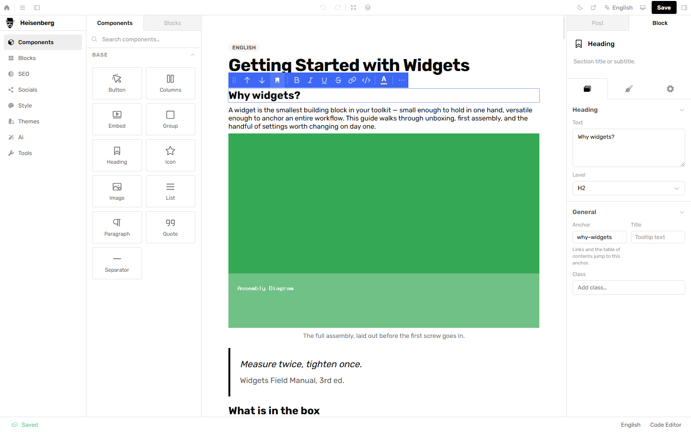
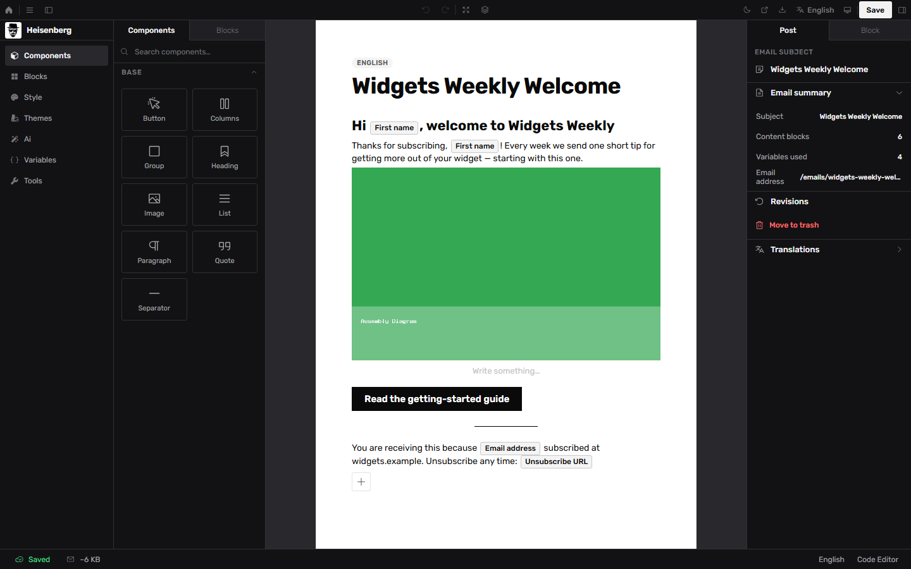
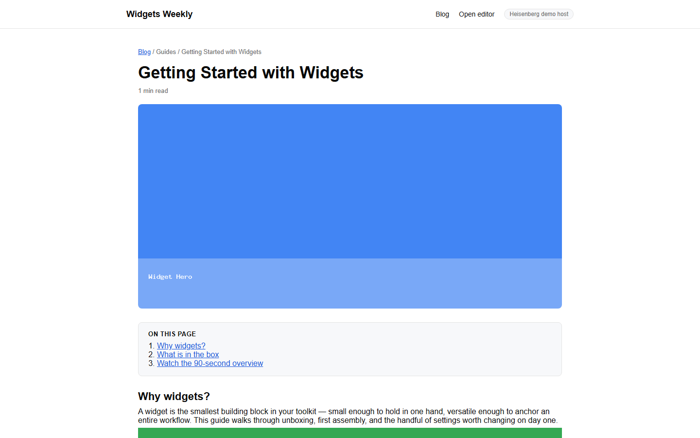

<p align="center">
  
</p>

<h1 align="center">Heisenberg</h1>

<p align="center">
  An embeddable content + email engine for Laravel, with AI and MCP built in.<br>
  Embed a Gutenberg-style editor, media library, taxonomy, post templates, a shared email builder, an AI writing assistant, and bidirectional MCP directly into any Laravel application — no build step, no theme system, no new user model.
</p>

<p align="center">
  <a href="https://packagist.org/packages/heisenberg/heisenberg"></a>
  <a href="https://packagist.org/packages/heisenberg/heisenberg"></a>
  
  
</p>

---

<p align="center">
  
</p>

<p align="center">
  
  
</p>

<p align="center">
  <sub>The post editor, the email editor (same block engine), and a published post in a host app. Run it yourself: <a href="docs/demo.md">docs/demo.md</a>.</sub>
</p>

Heisenberg has **no users, no theme lock-in, and no frontend framework requirements**. Your application keeps its existing user models, routes, and page layouts. Heisenberg brings the rich editor at `/editor`, structured content models, and clean service contracts to integrate seamlessly into your stack.

## Installation

```bash
composer require heisenberg/heisenberg
php artisan migrate
php artisan storage:link
```

Open **`/editor`** (for posts) or **`/editor/email`** (for emails) in your browser. The service provider is auto-discovered, migrations run automatically, and sensible defaults are provided out of the box.

In local development (`APP_ENV=local`), the editor is immediately accessible without extra configuration. Production environments authenticate through your own application users via the `RoleGate` contract.

Optional (recommended for responsive image variants):

```bash
composer require intervention/image:^3.9
```

## Authentication and Roles

Heisenberg connects to your existing users through the `RoleGate` contract with four canonical roles:

| Role | Permissions |
|---|---|
| `admin` | Full control, including AI and provider settings |
| `editor` | Publish, schedule, archive, and manage all media |
| `author` | Create and draft posts, upload media, edit own files |
| `viewer` | Read-only access to browse and select media |

The default gate supports **Spatie Laravel Permission** (`getRoleNames()`) or a standard `role` column on your `User` model:

```php
Schema::table('users', fn (Blueprint $table) => $table->string('role')->nullable());
// Example: $user->role = 'editor';
```

Role mappings can be customized in `config/heisenberg.php` under `roles`. You can also configure route middleware in `heisenberg.middleware.editor`, `.media`, and `.ai` (defaults to `['web']`).

### Where the editor sends people back to

Two separate settings, because they answer different questions:

| Setting | Question | Used by |
|---|---|---|
| `site_url` | Where does the **public site** live? | Canonical URLs, the SEO/social preview, a post's public link |
| `dashboard_url` | Where did the **person editing** come from? | The topbar's home button |

`site_url` is identity; `dashboard_url` is navigation. They differ on most platforms — the editor is
usually mounted on an admin or staff subdomain while readers are elsewhere — and different people
have different dashboards:

```php
// Everyone returns to the same place:
'dashboard_url' => env('HEISENBERG_DASHBOARD_URL'),

// Or each role returns to its own (keyed by YOUR role names; `default` catches the rest):
'dashboard_url' => [
    'admin'   => 'https://example.com/admin',
    'editor'  => 'https://example.com/staff',
    'default' => 'https://example.com/account',
],
```

Roles are read through your own `RoleGate`, so this works however roles are stored. When someone
holds several, the **map's order decides** — write the most privileged first. Unset, the button
falls back to `site_url`; with neither configured it stays inert rather than linking to the
editor's own host.

## Email Document Authoring and Personalization

Heisenberg includes a dedicated email builder surface sharing the same core block engine, translations, revisions, and AI assistant.

### 1. Register Host Personalization Variables

Define the metadata for variables available to your authors in `config/heisenberg.php`:

```php
'email' => [
    'variables' => [
        [
            'key' => 'user.first_name',
            'label' => 'First name',
            'description' => 'Recipient first name',
            'group' => 'User',
        ],
        [
            'key' => 'unsubscribe_url',
            'label' => 'Unsubscribe URL',
            'description' => 'One-click unsubscribe link',
            'group' => 'Links',
        ],
    ],
    'routes' => true,
    'route_prefix' => 'emails',
],
```

### 2. Author Email Content

Visit `/editor/email` to author email campaigns. The email editor provides:
- An email-safe block palette (headings, paragraphs, images, buttons, columns, groups, lists, quotes, separators).
- An Email Variables panel to click and insert tokens.
- Real-time `{{` autocomplete popup directly in the text editor with keyboard navigation.
- Live summary metrics displaying Subject, Content block count, and unique Variables used.

### 3. Render and Send

Heisenberg produces clean, self-contained MIME payloads with table-based layouts, inlined styles, and CID image attachments while preserving literal `{{ variable_name }}` tokens:

```php
use Heisenberg\Services\EmailRenderer;

$post = Post::query()->where('type', 'email')->findOrFail($id);
$result = app(EmailRenderer::class)->render($post, 'en');

// $result->subject   - Rendered subject line
// $result->html      - Inlined HTML with cid: image references
// $result->text      - Clean plain-text alternative
// $result->embeds    - Manifest of attachments for images
```

Your application performs runtime token substitution and sends via Laravel Mail (`HeisenbergMailable`) or your preferred Email Service Provider (ESP).

## Post Templates and Page Rendering

Heisenberg renders block content; your application owns the page surrounding it. Post templates are JSON contracts that define layout capabilities such as featured images, table of contents, comments, breadcrumbs, and reading time:

```jsonc
// resources/heisenberg-templates/blog/post.json
{
  "name": "heisenberg/blog",
  "render": { "view": "blog.show" },
  "capabilities": {
    "featuredImage":   { "enabled": true, "source": "post-attribute", "context": "hero" },
    "tableOfContents": { "enabled": true, "source": "entries" },
    "comments":        { "enabled": true, "allowGuests": true, "sortOrder": "newest" }
  }
}
```

Validate template contracts with:

```bash
php artisan templates:verify
```

In your controller, resolve `PostTemplateRegistryService` and render the body with `BlockRenderer::renderBlocks()` alongside block and theme stylesheets.

## Key Features

- **12 Block Types**: Heading, paragraph, image, button, quote, list, icon, separator, embed, and nestable groups/columns.
- **Full Authoring Chrome**: Inspector sidebar, floating toolbar, navigator tree, undo/redo, revisions, autosave with optimistic locking, and dark mode.
- **Media Library**: Drag-and-drop uploads, responsive variants, bilingual alt/caption metadata, and a virus scanning extension seam (`VirusScanner`).
- **Visual and Code View**: Round-trip editing between visual canvas and a compact shortcode dialect.
- **AI Writing Assistant & MCP**: Support for OpenAI, Anthropic, or OpenAI-compatible endpoints with streaming reasoning. Bidirectional MCP integration allows connecting external MCP tools or exposing Heisenberg as an MCP server.
- **Localization**: Full English and French UI translations. Content is bilingual-native — a
  post is one row carrying both languages (not separate documents that drift apart).
- **CSP Nonce Support**: Automatically integrates with `Vite::useCspNonce()` for strict Content Security Policies.

## Configuration

Publish the configuration file (optional):

```bash
php artisan vendor:publish --tag=heisenberg-config
```

Inspect any configuration differences against upstream defaults after upgrades:

```bash
php artisan heisenberg:config-diff
```

## Security

- All content writes pass through a unified validation and HTML sanitization pipeline (HTML Purifier).
- Media uploads enforce strict MIME and extension allowlists, size limits, and optional scan-before-write hooks.
- Anonymous development bypass is strictly restricted to `APP_ENV=local`.

## Documentation

| Document | Description |
|---|---|
| [`docs/STATUS.md`](docs/STATUS.md) | Current build status: what's shipped, what's in progress, known debt — updated every release |
| [`docs/ARCHITECTURE.md`](docs/ARCHITECTURE.md) | System map of every subsystem as it exists today, with diagrams |
| [`UPGRADING.md`](UPGRADING.md) | Per-version upgrade notes: schema, config, and behavior changes |
| [`docs/ROADMAP.md`](docs/ROADMAP.md) | What has to be true before 0.1.0 and 1.0 |
| [`docs/BLUEPRINT.md`](docs/BLUEPRINT.md) | Historical reconstruction spec for the block engine only (predates email/AI/MCP/comments/SEO) |
| [`docs/email-system.md`](docs/email-system.md) | Email renderer, variable tokens, and authoring reference |
| [`docs/block-schema.md`](docs/block-schema.md) | Writing and extending custom block contracts |
| [`docs/post-template-schema.md`](docs/post-template-schema.md) | Schema reference for custom post templates |
| [`docs/code-view.md`](docs/code-view.md) | Shortcode syntax and dialect specification |
| [`docs/media-library-backend-blueprint.md`](docs/media-library-backend-blueprint.md) | Media library architecture and web server hardening |
| [`docs/ai-mcp-plan.md`](docs/ai-mcp-plan.md) | AI assistant design and MCP tool integration |

## Requirements

- PHP ^8.2
- Laravel 11, 12, or 13
- Livewire ^4.3

## License

[Apache-2.0](LICENSE)
