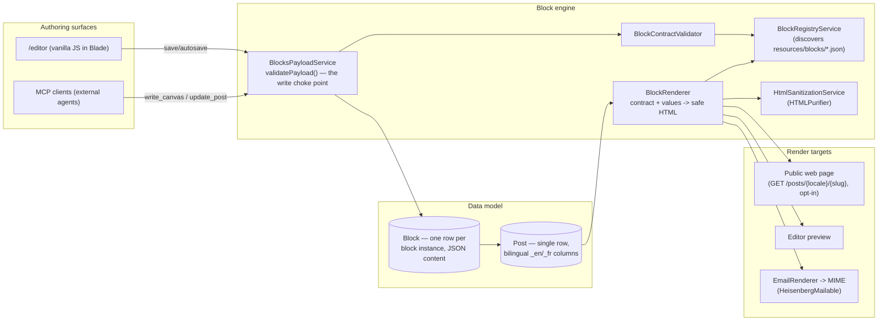
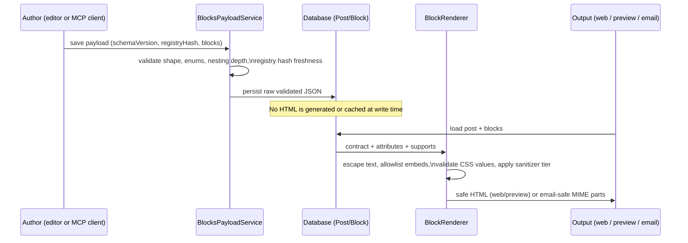

# Architecture

A system map of Heisenberg as it exists today (2026-09-19, v0.0.7). This is the "what's here and
how it fits together" document — for current build/feature status see
[`docs/STATUS.md`](STATUS.md); for the historical reconstruction spec of the block engine only,
see [`docs/BLUEPRINT.md`](BLUEPRINT.md). Each section below points to a deeper doc where one
exists; where it doesn't, the cited source files are the reference.

## 1. The shape of the system

Two facts drive most of the design: **one block engine renders both the editor canvas (in JS)
and the published output (in PHP)** from the same JSON contract, and **validation happens at
write time while sanitization/escaping happens at render time** — blocks are stored as raw
validated JSON, not pre-rendered HTML (`Post.rendered_html_en/fr` columns exist in the schema but
no current code path writes to them; every render call re-walks the block tree live).

## 2. Block engine

| Class | File | Job |
|---|---|---|
| `BlockRegistryService` | `src/Services/BlockRegistryService.php` (a ~200-line façade over `src/Blocks/*`: contract loader, path guard, localizer, inspector/style-panel derivers, icon + design-token catalogs) | Discovers contracts from `resources/blocks/**/*.json`, validates each, caches by mtime+size fingerprint, computes a `sha256` registry hash used to reject stale-schema saves, and **derives** inspector panels/controls from `supports.*` — panels are never hand-authored. |
| `BlockContractValidator` | `src/Services/BlockContractValidator.php` | Stateless validator: 16 required top-level keys, `{prefix}/<slug>` naming, attribute types, supports groups, `render`/`email` template shape, `security.allowCustomCss` must be `false`. |
| `BlockRenderer` | `src/Services/BlockRenderer.php` (a ~125-line façade over `src/Rendering/*`: `BlockTreeRenderer`, `BlockStyleCompiler`, `TemplateInterpolator`, and the sanitizers/resolvers `CssValueSanitizer`, `RichTextSanitizer`, `SafeUrlResolver`, `EmbedUrlResolver`, `HtmlEscaper`) | The one generic template walk that turns `{contract, attributes, supports}` into safe HTML — escapes all text, allowlists `iframe`/`video` src patterns, forces `rel="noopener noreferrer"` on `target=_blank`, validates every CSS value against a per-kind grammar, caps recursion at `MAX_NESTING_DEPTH = 20`. Runs identically for the web render, the preview, and (via an `email` surface flag) the email render. |
| `HtmlSanitizationService` | `src/Services/HtmlSanitizationService.php` | Two HTMLPurifier configs: a hardened one for `html_raw` blocks, a strict inline-only one (p/br/strong/em/b/i/u/s/code/a/ul/ol/li/span[style], color/background-color only) for rich text. Its own docblock calls itself a "final backstop" pass — today nothing calls it as a second pass over already-rendered output; sanitization in practice happens inside `BlockRenderer` itself. |

12 block contracts ship today: `button`, `column`, `columns`, `embed`, `group`, `heading`, `icon`,
`image`, `list`, `paragraph`, `quote`, `separator`. Schema reference: [`docs/block-schema.md`](block-schema.md).

## 3. Write pipeline

`BlocksPayloadService::validatePayload()` (`src/Services/BlocksPayloadService.php`) is the single
choke point for every block write in the system — confirmed by exactly two call sites:
`SavePostRequest` (the editor's save/autosave endpoint, `src/Http/Controllers/PostController.php`)
and `McpToolRegistry`'s write-post tool. It checks schema version, the registry hash (rejecting a
payload built against a stale contract set), block name/attribute/enum shape, and recurses
`innerBlocks` to the same depth cap as `BlockRenderer`. It does **not** sanitize HTML — that is a
render-time concern, not a write-time one; blocks persist as raw validated JSON.

## 4. Data model

All tables are configurable via `config('heisenberg.tables.*')`; defaults shown below.

| Model | Table (default) | Notes |
|---|---|---|
| `Post` | `heisenberg_posts` | Single row per logical post. Bilingual content lives in suffixed columns (`title_en`/`title_fr`, `excerpt_en`/`fr`, `rendered_html_en`/`fr`) rather than one row per locale — see [content-translation.md](content-translation.md). `locale` is an `enum('en','fr')` marking the post's *own* authored/home locale (not per-viewer); a locale-column migration converting this to a plain string is in progress on another branch (see `UPGRADING.md`'s Unreleased section). `type` distinguishes `post` from `email`. |
| `Block` | `heisenberg_blocks` | One row per block instance; `content` is the validated JSON payload; ordered, soft-deletes cascade with the post. |
| `PublicFile` | `heisenberg_public_files` | Media library asset; bilingual alt/caption; small/medium responsive variants; no `svg` in the extension allowlist (see §6). |
| `Revision` | `heisenberg_post_revisions` | Snapshot on every update, restorable through the same document-replace path the undo stack uses. |
| `Category` / `Tag` | `heisenberg_categories` / `heisenberg_tags` | Bilingual names; many-to-many with posts via `heisenberg_category_post` / `heisenberg_post_tag` pivots (categories moved from a single FK to a pivot in the `2026_08_03` migrations — see `UPGRADING.md`). |
| `Comment` | `heisenberg_comments` | Self-referencing `parent_id` thread; status (`pending`/`approved`/`spam`/`trash`) is deliberately not mass-assignable. |
| `SeoMeta` | `seo_meta` (unprefixed, polymorphic `able_type`/`able_id`) | Bilingual meta title/description/OG fields, JSON-LD `schema_data`, `in_sitemap` flag. |
| `Pattern` | `heisenberg_patterns` | Saved/reusable block-tree snippets, browsed from the **Patterns** tab and saved from a container's toolbar. |
| `TocEntry` | `heisenberg_post_toc_entries` | Authored table-of-contents entries. |
| `AiConversation` / `AiChatMessage` | `heisenberg_ai_conversations` / `heisenberg_ai_messages` | AI assistant chat history, scoped per author. |

## 5. Editor frontend

There is no JS build step: no bundler (the root `package.json` exists only to run the `tests/js` harnesses), no `resources/js/` directory. The
editor's ~55 Blade files under `resources/views/components/live/` (~16,000 lines combined) each
own an inline `<script>` that talks to the document only through a global `window.hbEditor` API
exposed by `block-runtime.blade.php` (a short table of contents that `@include`s 13 ordered partials from `components/live/block-runtime/` into ONE `<script>` and ONE IIFE — a purely on-disk split; the emitted page is byte-identical to the former 2,014-line single file). That runtime also owns undo/redo: a debounced
(400 ms), snapshot-based history stack capped at 100 entries, wired to Ctrl/Cmd+Z / Shift+Z and
the topbar buttons via an `hb:history` event.

CSS is served, not compiled: `EditorController::css()` concatenates `tokens.css` plus every file
under `resources/css/editor/*.css` at request time with `Cache-Control: no-store` — a documented,
still-open "dev-only" shortcut (`TODO.md` 6.5, carried into `docs/STATUS.md`'s known debt).

The **only** Livewire component in the package is `src/Livewire/MediaLibrary.php`; everything
else on `/editor` is vanilla JS.

A second, textual editing surface exists over the same document model: the **shortcode dialect**
(`docs/code-view.md`), implemented independently in PHP (`ShortcodeDialect`/`ShortcodeParser`/
`ShortcodeSerializer` under `src/Services/`) and in JS (inline in `code-editor.blade.php`, exposed
as `window.hbCodeView`) — deliberately duplicated because "one runs in a browser with no round
trip and the other on a server with no browser." Parity between the two implementations is
enforced by a shared fixture corpus at `tests/Fixtures/shortcode/*.txt`, round-tripped by both
`tests/Ai/ShortcodeParityTest.php` (PHP) and `tests/js/shortcode-parity.mjs` (JS, via jsdom).

## 6. Media library

`MediaLibraryService` (`src/Services/MediaLibraryService.php`) handles upload, listing, metadata
updates, and deletion of `PublicFile` records, generating small/medium responsive variants
(skipped above a megapixel cap) when `intervention/image` is installed. Extension allowlisting is
enforced **inside the service** (`enforceAllowedExtension()`), not only in the upload form
request — a deliberate hardening after an SVG-upload path was found bypassing the request-level
`mimes:` rule via non-HTTP callers (e.g. Livewire); `PublicFile::TYPES` excludes `svg` today.
Uploads pass through an injected `VirusScanner` contract (default: a no-op `NullVirusScanner`)
before being written to disk. See [`media-library-backend-blueprint.md`](media-library-backend-blueprint.md).

## 7. Taxonomy

`Category` (self-parenting, bilingual `name_en`/`name_fr`) and `Tag` (flat, bilingual) attach to
posts many-to-many via `heisenberg_category_post` and `heisenberg_post_tag`. `CategoryController`
/ `TagController` provide CRUD; `PostCategoryController` / `PostTagController` provide
attach/detach. Categories moved from a single `category_id` FK to a pivot table in the
`2026_08_03` migrations — see `UPGRADING.md`.

## 8. Templates + public rendering

Post templates are JSON contracts (`resources/templates/article/article.json`), discovered and
validated by `PostTemplateRegistryService` / `PostTemplateContractValidator`
(`php artisan templates:verify`). **This registry is not yet consulted by the actual render
path**: neither `PostPublicController` nor `PreviewController` reads a post's template to decide
layout — the page shell is hardcoded Blade. What *is* live from the template concept are its four
capability-adapter contracts (`PostViewsProvider`, `PostCommentProvider`, `RelatedPostsProvider`,
`PostSeoMetaProvider`), which the public/preview controllers do consult directly. See
[`post-template-schema.md`](post-template-schema.md) and `docs/STATUS.md` for the caveat.

`GET /posts/{locale}/{slug}` is the bundled, **opt-in** (`heisenberg.public.routes`, default
`false`) public post route — `PostPublicController::show()` runs the real `BlockRenderer`
pipeline plus SEO head tags, hreflang alternates, featured image, and comments, and 404s for
`type = 'email'` posts. A host that wants a different URL shape leaves this off and binds its own
`PostUrlResolver`.

## 9. Comments

`Comment` rows thread via a self-referencing `parent_id`; status starts `pending` unless
auto-approved, and status is not mass-assignable — only `NativeCommentProvider::submit()` may set
it. `NativeCommentProvider` (the default `PostCommentProvider` binding) groups approved comments
into threads; `CommentModerationController` gates approve/spam/trash/reply behind a
`comments.moderate` role ability. Routes are opt-out (`heisenberg.comments.routes`).

## 10. SEO

`SeoMeta` (polymorphic, bilingual) is written by `PostController::applySeo()` via
`NativeSeoMetaProvider`. `SeoAnalyzer` is a pure, deterministic scorer over a post + its
`SeoMeta` + block tree, shared by the editor's SEO panel and the MCP `analyze_seo` tool.
`SeoUrlResolver` (the default `PostUrlResolver`) resolves `heisenberg.seo.url_template` (a string
or per-locale map) or falls back to the package's own preview route. `SitemapController`
(`GET /sitemap.xml`, opt-out via `heisenberg.seo.sitemap`) emits one `<url>` per eligible
published post per locale with hreflang alternates. See [`seo-system.md`](seo-system.md).

## 11. Email

Emails are posts with `type = 'email'`, authored in the same editor with a restricted,
email-safe block palette (a block opts in via an `email` section in its contract).
`EmailRenderer` (`src/Services/EmailRenderer.php`) renders through the same
substitution/sanitization engine as the web path, then: resolves theme tokens to literal
values and email-safe font stacks, wraps output in a table-based 600px shell, rewrites images to
`cid:` MIME embeds, inlines all CSS, and generates a plain-text alternative. `HeisenbergMailable`
is the convenience Laravel-mail seam over the resulting `{html, text, subject, embeds, sizeBytes}`
payload. As of 2026-09-17, Heisenberg does **not** substitute `{{ variable }}` placeholders —
that was removed (see `UPGRADING.md`); the host reads the rendered text and substitutes at send
time. `config('heisenberg.email.variables')` is display-only metadata so the editor can label
known tokens. Full detail: [`email-system.md`](email-system.md).

## 12. AI assistant

`AiToolRunner` (`src/Services/AiToolRunner.php`) drives the tool-calling loop: request → tool use
→ execute → tool result → repeat, capped by `heisenberg.ai.mcp.client.max_iterations` (default
16), with per-call result caching and a graceful final pass when the iteration budget is
exhausted rather than erroring. Ten provider presets ship (OpenAI, Anthropic, Google, xAI,
OpenRouter, Groq, DeepSeek, Mistral, Ollama, LM Studio); only two wire *formats* actually exist
(`anthropic`, and an OpenAI-compatible chat-completions shape every other vendor speaks). Settings
(provider/model/tool config) are plain JSON at `storage/app/heisenberg/ai.json`; API keys never
live there — they go through the `AiCredentialStore` contract (default:
`EncryptedFileCredentialStore`) and are never returned by any read endpoint.

## 13. MCP — bidirectional

Heisenberg is both an MCP **server** (inbound — other agents author through it) and an MCP
**client** (outbound — its own assistant calls other MCP servers), over HTTP/JSON-RPC only (no
stdio, no SSE) in both directions.

- **Server**: `McpToolRegistry` (`src/Services/McpToolRegistry.php`) is the façade — it collects the
  domain tool providers under `src/Mcp/Tools/*` (each implementing `McpToolProvider`), tier-filters
  the catalogue, and authorizes + dispatches calls. Every content-writing tool funnels through
  `src/Mcp/Support/ContentBlockPipeline` (the single MCP caller of
  `BlocksPayloadService::validatePayload()`) via `PostAccess::writePost()`. The catalogue is pinned
  byte-for-byte by `tests/Mcp/ToolCatalogueSnapshotTest`. Together they expose tools for post CRUD/lifecycle
  (`list_posts`, `get_post`, `create_post`, `update_post`, `set_post_status`, `trash_post`,
  `restore_post`), revisions, translation (`create_translation`), taxonomy, media, SEO
  (`get_seo`/`update_seo`/`analyze_seo`), block/content authoring (`write_canvas`,
  `set_page_title`, `render_preview`), and discovery (`list_blocks`, `describe_block`,
  `search_icons`, `search_web`, `get_theme`). Every writing tool funnels through the same
  `BlocksPayloadService` choke point the editor uses and snapshots a revision first.
  `McpServerController` + `McpTokenMiddleware` (bearer-token, tiered read/authors/admins) serve a
  single `POST /heisenberg/mcp` endpoint, off by default (`heisenberg.ai.mcp.server.enabled`) and
  deliberately outside the `web` middleware group (no session/CSRF).
- **Client**: `HttpMcpClient` implements the `McpClient` contract; `AiToolRunner` discovers and
  calls tools on host-configured outbound servers (allow-listed in the AI settings JSON, each
  with an `auth_env`-named credential). **No SSRF guard exists yet** — outbound requests are
  checked for an http(s) scheme and a resolvable host only; reaching localhost or an internal VPC
  address is current, acknowledged behavior, not yet gated (tracked as open work, see
  `docs/STATUS.md`). This is separate from the SSRF-guard work described as in progress on this
  branch.

## 14. Contracts — extension seams

All 14 interfaces live in `src/Contracts/`, bound in `src/HeisenbergServiceProvider.php`.

| Contract | Default adapter | Config key |
|---|---|---|
| `MediaResolver` | `NullMediaResolver` | `heisenberg.media_resolver` |
| `RoleGate` | `ConfigRoleGate` | `heisenberg.role_gate` |
| `AuditSink` | `NullAuditSink` | `heisenberg.audit_sink` |
| `IconProvider` | `PhosphorIconProvider` | `heisenberg.icon_provider` |
| `PostUrlResolver` | `SeoUrlResolver` | `heisenberg.seo.url_resolver` |
| `PostViewsProvider` | `NullPostViewsProvider` | `heisenberg.post_template.post_views_provider` |
| `PostCommentProvider` | `NativeCommentProvider` | `heisenberg.post_template.comments_provider` |
| `RelatedPostsProvider` | `NullRelatedPostsProvider` | `heisenberg.post_template.related_posts_provider` |
| `PostSeoMetaProvider` | `NativeSeoMetaProvider` | `heisenberg.post_template.seo_meta_provider` |
| `VirusScanner` | `NullVirusScanner` | `heisenberg.media.virus_scanner` |
| `AiCredentialStore` | `EncryptedFileCredentialStore` | `heisenberg.ai.credential_store` |
| `McpClient` | none — throws if unset | `heisenberg.ai.mcp.client.adapter` |
| `AiProvider` | resolved via `AiProviderRegistry` per active provider's format | `heisenberg.ai.formats.{format}.adapter` |
| `HeisenbergUser` | not bound — a marker interface the host's own `User` model implements | n/a |

A host swaps any of these by rebinding the config key to its own class; none require touching
package internals.

## 15. Write/read pipeline, end to end

## Related docs

- [`docs/STATUS.md`](STATUS.md) — current build status, in-progress work, known debt.
- [`docs/BLUEPRINT.md`](BLUEPRINT.md) — block-engine reconstruction spec (historical, block engine only).
- [`docs/block-schema.md`](block-schema.md), [`docs/post-template-schema.md`](post-template-schema.md), [`docs/code-view.md`](code-view.md), [`docs/email-system.md`](email-system.md), [`docs/seo-system.md`](seo-system.md), [`docs/content-translation.md`](content-translation.md), [`docs/media-library-backend-blueprint.md`](media-library-backend-blueprint.md), [`docs/ai-mcp-plan.md`](ai-mcp-plan.md).
- [`UPGRADING.md`](../UPGRADING.md) — schema/config/behavior changes per release.
